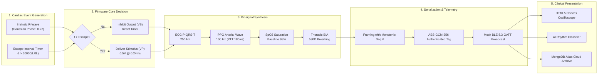

# HealthHeart™ | LeadlessGuard™ Data-Flow Diagram
**Classification:** `SIMULATION` / `MONITORING`

---

## 1. Real-Time Telemetry Data Flow

```mermaid
flowchart LR
    subgraph S1["1. Cardiac Event Generation"]
        E1["Intrinsic R-Wave\n(Gaussian Phase: 0.22)"]
        E2["Escape Interval Timer\n(t > 60000/LRL)"]
    end

    subgraph S2["2. Firmware Core Decision"]
        D1{"t > Escape?"}
        D2["Inhibit Output (VS)\nReset Timer"]
        D3["Deliver Stimulus (VP)\n0.5V @ 0.24ms"]
    end

    subgraph S3["3. Biosignal Synthesis"]
        B1["ECG P-QRS-T\n250 Hz"]
        B2["PPG Arterial Wave\n100 Hz (PTT 180ms)"]
        B3["SpO2 Saturation\nBaseline 98%"]
        B4["Thoracic BIA\n580Ω Breathing"]
    end

    subgraph S4["4. Serialization & Telemetry"]
        P1["Framing with Monotonic Seq #"]
        P2["AES-GCM-256 Authenticated Tag"]
        P3["Mock BLE 5.3 GATT Broadcast"]
    end

    subgraph S5["5. Clinical Presentation"]
        U1["HTML5 Canvas Oscilloscope"]
        U2["AI Rhythm Classifier"]
        U3["MongoDB Atlas Cloud Archive"]
    end

    E1 --> D1
    E2 --> D1
    D1 -- No --> D2
    D1 -- Yes --> D3
    D2 --> B1
    D3 --> B1
    B1 --> B2
    B2 --> B3
    B3 --> B4
    B4 --> P1
    P1 --> P2
    P2 --> P3
    P3 --> U1
    P3 --> U2
    P3 --> U3
```
